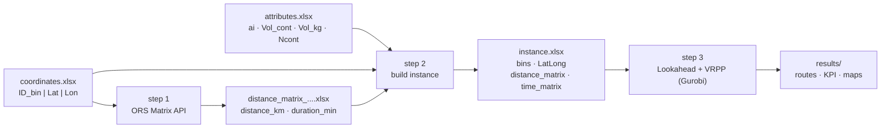

# VRPP + Lookahead — selective waste collection

Plan bin collection routes (paper/cardboard, plastic, …) from two Excel files and
a road network. The project combines:

1. **Real road distance matrix** (OpenRouteService / OpenStreetMap).
2. **Lookahead**: classification of bins into `MustGo` / `MustGoLA` / `Optional`
   based on their current level and their daily fill rate.
3. **VRPP** (*Vehicle Routing Problem with Profits*) solved with **Gurobi**: it
   chooses *which* bins to collect and in *what* order, maximising net profit.

A reference instance is included so you can run the whole thing before preparing
your own data: **491 bins of cluster C7** (Runa – Sobral de Monte Agraço –
Arruda dos Vinhos), paper/cardboard fraction.

---

## Table of contents

1. [Quick start](#1-quick-start)
2. [Requirements](#2-requirements)
3. [Installation](#3-installation)
4. [The Excel files you need to prepare](#4-the-excel-files-you-need-to-prepare)
5. [Where to put your files and how to point the project at them](#5-where-to-put-your-files-and-how-to-point-the-project-at-them)
6. [Where to run the commands](#6-where-to-run-the-commands)
7. [Running the pipeline](#7-running-the-pipeline)
8. [Outputs](#8-outputs)
9. [Editable parameters](#9-editable-parameters)
10. [Troubleshooting](#10-troubleshooting)
11. [The model](#11-the-model)
12. [Project architecture](#12-project-architecture)
13. [Origin of the code](#13-origin-of-the-code)

---

## 1. Quick start

If you only want to see the project work with the bundled example data:

```bash
# 1. Download the project and enter its folder
git clone <repo-url>
cd vrpp-lookahead

# 2. Create an isolated Python environment and install the dependencies
python -m venv .venv
.venv\Scripts\activate                 # Windows
# source .venv/bin/activate            # Linux / macOS
pip install -r requirements.txt

# 3. Check the data without running the optimiser (no Gurobi licence needed)
python scripts/03_run_vrpp.py --diagnose-only

# 4. Run the full optimisation (needs a Gurobi licence)
python scripts/03_run_vrpp.py
```

Results land in `results/491_C7/`. Steps 1 and 2 of the pipeline can be skipped
for this example because the distance matrix and the instance file are already on
disk.

To use **your own data**, read sections 4 → 7.

---

## 2. Requirements

| What | Version | Needed for | Notes |
|---|---|---|---|
| **Python** | 3.10 or newer | everything | tested on 3.12 |
| **Gurobi** (`gurobipy`) | 11.0+ | step 3 only | installed by `pip`, but needs a **licence** — see below |
| **OpenRouteService key** | free | step 1 only | free sign-up, see below |

Everything else (pandas, numpy, openpyxl, PyYAML, requests, folium) is installed
automatically by `pip install -r requirements.txt`.

### Gurobi licence

`pip` installs Gurobi with a free *size-limited* licence that only handles small
models. It is **not enough for 491 bins** — you will need an academic licence
(free for students and researchers, from <https://www.gurobi.com/academia/>) or a
commercial one.

You can still explore the project without a licence: `--diagnose-only` (step 3)
and steps 1 and 2 never touch Gurobi.

### OpenRouteService key

Only needed for **step 1** (building the distance matrix). Free sign-up at
<https://openrouteservice.org/dev/#/signup>. The free plan allows roughly 40
requests per minute, which the project respects automatically.

If you use the bundled example data, the matrix already exists and you do not
need a key at all.

---

## 3. Installation

**Windows (PowerShell or CMD):**

```bash
git clone <repo-url>
cd vrpp-lookahead

python -m venv .venv
.venv\Scripts\activate
pip install -r requirements.txt

copy .env.example .env
```

**Linux / macOS:**

```bash
git clone <repo-url>
cd vrpp-lookahead

python3 -m venv .venv
source .venv/bin/activate
pip install -r requirements.txt

cp .env.example .env
```

> No Git? Download the repository as a ZIP from GitHub ("Code" → "Download ZIP"),
> unzip it, and open a terminal inside the unzipped folder. The rest is identical.

Then open the `.env` file in a text editor and paste your OpenRouteService key:

```
ORS_API_KEY=your_real_key_here
```

`.env` is listed in `.gitignore`, so your key never gets committed.

**Every time you open a new terminal**, activate the environment again before
running anything:

```bash
.venv\Scripts\activate          # Windows
source .venv/bin/activate       # Linux / macOS
```

You can tell it worked because the prompt starts with `(.venv)`.

---

## 4. The Excel files you need to prepare

The project needs **two Excel files**. Both must have their data on the **first
sheet** (the sheet name does not matter), with the column names in **row 1**.

### File A — coordinates

One row per location, **including the depot**. The depot is the place where
vehicles start and finish, and it is identified by `ID_bin = 0`.

| Column | Type | Meaning |
|---|---|---|
| `ID_bin` | integer | unique id of the collection point. **`0` = depot** |
| `Latitude` | decimal | latitude in decimal degrees (e.g. `39.188745`) |
| `Longitude` | decimal | longitude in decimal degrees (e.g. `-9.148513`) |

Example (this is the real bundled file, `data/raw/coordinates_491_C7_Runa_Sobral_Arruda.xlsx`):

| ID_bin | Latitude | Longitude |
|---|---|---|
| 0 | 39.188745 | -9.148513 |
| 266 | 38.997533 | -9.128058 |
| 268 | 38.989469 | -9.199111 |
| 295 | 38.937812 | -9.103722 |

Rules:

* **Exactly one row must have `ID_bin = 0`** — that is the depot. If it is
  missing, step 1 stops with `No depot found with ID_bin = 0`.
* Bin ids must be **unique**; duplicates are rejected.
* Use a **decimal point**, not a comma. If your Excel locale writes `39,188745`,
  the value will be read as text and step 1 will stop with
  `There are empty or non-numeric coordinates`.
* Coordinates must be **on or near a road**. Points in the middle of a field or
  offshore produce `NaN` cells in the matrix, and step 3 will refuse the instance.
* The order of the rows does not matter.

### File B — attributes

One row per bin, **without the depot**. Every `ID_bin` from file A (except `0`)
must appear here.

| Column | Type | Meaning | Used by the model? |
|---|---|---|---|
| `id_contentor` | integer | bin id — must match `ID_bin` in file A | yes (key) |
| `ai` | decimal | daily fill rate, as a **% of the bin capacity** | yes |
| `Vol_cont` | decimal | volume of **one** container at this point, in m³ | yes |
| `Vol_kg` | decimal | waste currently in the bin, in **kg** | yes |
| `Ncont` | integer | how many containers stand at this point | yes |
| `Si` | decimal | legacy column from the source dataset | **no — ignored** |

Example (the real bundled file, `data/raw/attributes_491_C7_paper.xlsx`):

| id_contentor | Si | ai | Vol_cont | Vol_kg | Ncont |
|---|---|---|---|---|---|
| 266 | 100.0 | 9.05 | 2.50 | 40.0 | 1 |
| 268 | 100.0 | 16.00 | 3.75 | 120.0 | 2 |
| 295 | 100.0 | 14.06 | 2.50 | 40.0 | 1 |
| 297 | 100.0 | 11.77 | 2.50 | 40.0 | 1 |

Rules:

* `Si` is kept in the reference file for historical reasons but the code never
  reads it. You can leave the column out entirely.
* `Ncont` and `Vol_cont` must both be **greater than zero**, otherwise the bin
  capacity would be zero and loading stops with `CAP_CONT <= 0`.
* If your file uses `ID_bin` instead of `id_contentor`, the project renames it
  automatically.
* The column names are in Portuguese because they come from the original
  dataset. They are the **only** Portuguese left in the project, and they are
  what the code looks for — keep them exactly as written above.

### How the two files fit together

From these columns the project derives, for every bin `i`:

```
CAP_CONT_i = B · Ncont_i · Vol_cont_i     bin capacity           [kg]
Si_kg_i    = Vol_kg_i                     current level          [kg]
ai_kg_i    = ai_i/100 · CAP_CONT_i        daily accumulation     [kg/day]
```

`B` is the waste density in kg/m³, set in the configuration file (16 for
paper/cardboard). So `Vol_cont` is a **volume** and the model turns it into a
**weight** using `B`.

---

## 5. Where to put your files and how to point the project at them

**1. Copy both Excel files into `data/raw/`.** Name them however you like:

```
data/raw/coordinates_mytown.xlsx
data/raw/attributes_mytown.xlsx
```

**2. Copy the example configuration** and give it a new name:

```bash
copy config\instance_491_C7.yaml config\instance_mytown.yaml     # Windows
cp config/instance_491_C7.yaml config/instance_mytown.yaml       # Linux / macOS
```

**3. Open `config/instance_mytown.yaml`** in a text editor and edit the top part:

```yaml
label: mytown                    # short name; used for the results folder
description: 380 paper bins, my town

paths:
  coordinates: data/raw/coordinates_mytown.xlsx     # ← your file A
  attributes:  data/raw/attributes_mytown.xlsx      # ← your file B
  ors_matrix:  data/matrices/distance_matrix_mytown.xlsx   # ← will be CREATED by step 1
  instance:    data/instances/instance_mytown.xlsx         # ← will be CREATED by step 2
  results:     results/mytown                              # ← will be CREATED by step 3
```

Only the first two paths point at files you supply. The other three are **outputs**
— you just choose where they get written, and the folders are created for you.

Paths are relative to the project root, so `data/raw/...` means
`vrpp-lookahead/data/raw/...`. Absolute paths work too.

**4. Adjust the model parameters** further down the same file — at minimum `B`
(waste density) and `Q` (vehicle capacity in kg). See
[section 9](#9-editable-parameters).

That is the whole setup. **You never have to edit Python code**: all three steps
are agnostic to the size and the origin of the instance.

---

## 6. Where to run the commands

Everything runs **from a terminal, in the project root folder** — the folder that
contains `README.md`, `config/`, `scripts/` and `src/`.

**Opening a terminal there:**

* **Windows** — open the `vrpp-lookahead` folder in File Explorer, then type
  `powershell` in the address bar and press Enter. Or open PowerShell and run
  `cd C:\path\to\vrpp-lookahead`.
* **macOS** — right-click the folder → *Services* → *New Terminal at Folder*.
* **Linux** — right-click inside the folder → *Open in Terminal*.
* **VS Code (any OS)** — *File* → *Open Folder* → pick `vrpp-lookahead`, then
  *Terminal* → *New Terminal*. It opens in the right place automatically.

You can confirm you are in the right place with:

```bash
python scripts/03_run_vrpp.py --help
```

If it prints the help text, you are good. If it says
`can't open file ... 03_run_vrpp.py`, you are in the wrong folder.

Remember to activate the virtual environment first (`(.venv)` in the prompt).

> Prefer notebooks? `notebooks/VRPP_Lookahead.ipynb` runs the same three steps
> cell by cell. Start Jupyter from the project root with `jupyter notebook`.

---

## 7. Running the pipeline



Add `--config config/instance_mytown.yaml` to every command below. If you leave
it out, the bundled `config/instance_491_C7.yaml` is used.

### Step 1 — build the distance matrix (needs the ORS key)

This is the step that turns your coordinates into real road distances. It asks
OpenRouteService for the travel distance and time between **every pair** of
locations.

```bash
python scripts/01_build_ors_matrix.py --config config/instance_mytown.yaml
```

The request is split into blocks of sources sized `floor(max_routes_per_request / n)`,
so the server limit is never exceeded. For the 492-node example that is 7 sources
per request, 71 requests, about 2 minutes. The script prints the estimate before
it starts:

```
Nodes in matrix: 492  |  Depot: 0  |  Mode: driving-hgv
ORS limit: 3500 routes/request
Source block: 7  ->  7x492=3444 routes/request
Requests needed: 71
Estimated time: ~2 min
```

It writes the file named in `paths.ors_matrix`, a workbook with 6 sheets:
`ordered_nodes`, `distance_km`, `duration_min`, `distance_model`,
`duration_model`, `long_format`.

> **Run this only once per set of coordinates.** The matrix depends solely on the
> locations, not on how full the bins are. Keep the file — regenerating it costs
> time and API quota. For the bundled instance it already exists in
> `data/matrices/`, so you can skip straight to step 2.

Useful options:

```bash
--mode driving-car       # driving-hgv (default) | driving-car | cycling-regular | foot-walking
--route-limit 2500       # lower the per-request limit if your ORS plan is stricter
```

### Step 2 — build the instance

Merges your two Excel files with the distance matrix into a single workbook that
step 3 consumes.

```bash
python scripts/02_build_instance.py --config config/instance_mytown.yaml
```

This is where most data problems surface, with an explicit message: missing ids,
duplicates, misordered matrices. It finishes by printing a summary you should
sanity-check:

```
Bins        : 491   (total nodes: 492 = depot + 491)
Depot       : Lat=39.188745  Lon=-9.148513
Distances   : mean 13.62 km | max 52.73 km
CAP_CONT    : min 40.0 | mean 43.2 | max 239.5 kg | TOTAL 21231.55 kg
Si_kg       : min 1.00 | mean 21.21 | max 120.00 kg | TOTAL 10414.30 kg
ai_kg       : min 0.48 | mean 4.94 | max 80.29 kg/day | TOTAL 2423.54 kg/day
```

Run it again whenever you change your input Excel files or the density `B`.

### Step 3 — Lookahead + VRPP

Start with a dry run. It classifies the bins and tells you whether your fleet can
even cover the mandatory ones — **no Gurobi licence needed**:

```bash
python scripts/03_run_vrpp.py --config config/instance_mytown.yaml --diagnose-only
```

```
     Group  N_points  Si_kg  Pct_Si_total
    MustGo        69 3013.0         28.93
  MustGoLA        31 1091.1         10.48
  Optional       352 6269.6         60.20
Near empty        39   40.6          0.39

MustGo weight  : 3013.00 kg  ->  at least 1 route(s) of 4000 kg
MAX_ROUTES     : 2  (capacity 8000 kg)
  OK — 4987.00 kg of slack over the MustGo
```

If it warns that `MAX_ROUTES` is too low, raise `MAX_ROUTES` or `Q` before
optimising — otherwise some mandatory bins get downgraded (see
[section 11](#11-the-model)).

Then run the real thing:

```bash
python scripts/03_run_vrpp.py --config config/instance_mytown.yaml
```

Any parameter can be overridden for a single run without editing the YAML:

```bash
python scripts/03_run_vrpp.py --Q 5000 --MAX_ROUTES 3 --TIME_LIMIT 3600
python scripts/03_run_vrpp.py --days 5 --window 3 --no-maps
```

This step can take a long time — up to `TIME_LIMIT` (6 hours by default). Lower
it with `--TIME_LIMIT 600` for a first look; the solver returns the best solution
it found so far, along with the optimality gap it managed to prove.

---

## 8. Outputs

For every simulated day, in `results/<label>/Day_XX/`:

* `route_N.html` — open it in any browser: a map with the stop sequence
  (red = MustGo, orange = MustGoLA, blue = Optional, house = depot).
* `result_Day_XX.xlsx` — 10 sheets:

| Sheet | Content |
|---|---|
| `1_Lookahead` | level, forecast and group of each bin |
| `2_KPI_General` | objective function, waste, bins, routes, solver |
| `3_KPI_Routes` | one row per route, with the full stop sequence |
| `4_RouteN_Seq` | detailed sequence of each route |
| `5_MustGo` / `6_MustGoLA` | critical points and whether they were collected |
| `7_Not_Visited` | bins left behind, and the reason why |
| `8_All_Bins` | status of every point |
| `9_Parameters` | parameters of this run |
| `10_Verification` | capacity, arc and gap checks |

And at the root of `results/<label>/`:

* `summary_<label>_all_days.xlsx` — KPI per day, consolidated KPI and diagnostics.
* `parameters_used.json` — two blocks: `parameters`, the exact configuration that
  produced these results, and `environment`, the solver and interpreter versions,
  the resolved thread count and the seed. A MILP stopped at a non-zero gap is
  reproducible only for the same solver version, seed and thread count, so the
  parameters alone would not pin the result down. The file also lists any
  reproducibility caveat it detects, such as an unset seed.

---

## 9. Editable parameters

Edited in the YAML or, occasionally, on the command line. The ones in the `model`
section are the most frequently touched:

| Parameter | Meaning | Unit | Default | CLI flag |
|---|---|---|---|---|
| `B` | waste density | kg/m³ | 16 | `--B` |
| `Q` | vehicle capacity | kg | 3500 | `--Q` |
| `R` | revenue per kg collected | €/kg | 0.1625 | `--R` |
| `C` | travel cost | €/km | 1.0 | `--C` |
| `OMEGA` | fixed cost per vehicle | € | 0.1 | `--OMEGA` |
| `MAX_ROUTES` | max number of routes (`k ≤ MAX_ROUTES`) | — | 2 | `--MAX_ROUTES` |
| `MIP_GAP` | solver tolerance | — | 0.05 (5 %) | `--MIP_GAP` |
| `TIME_LIMIT` | solver time limit | s | 21600 (6 h) | `--TIME_LIMIT` |

Other blocks:

| Block | Parameter | Meaning | CLI flag |
|---|---|---|---|
| `lookahead` | `days` | simulated days | `--days` |
| | `window` | lookahead horizon (days) | `--window` |
| | `threshold_mg` | % for classifying as `MustGo` | `--threshold-mg` |
| | `threshold_overflow` | % for classifying as `MustGoLA` | `--threshold-overflow` |
| | `near_empty_level_pct` | diagnostics only: what counts as "almost empty" | — |
| `solver` | `knn` | nearest neighbours per node (arc filtering) | `--knn` |
| | `seed` | Gurobi seed (`null` = default) | `--seed` |
| | `keep_mustgo_arcs` | `true` = never filter out MustGo–MustGo arcs | — |
| | `generate_maps` | generate the Folium maps | `--no-maps` |
| `ors` | `transport_mode` | `driving-hgv`, `driving-car`, `cycling-regular`, … | `--mode` |
| | `max_routes_per_request` | ORS server limit of routes per request | `--route-limit` |
| | `pause_s` | pause between requests (free plan: ≤ 40/min) | — |

The `ors` flags (`--mode`, `--route-limit`) belong to `01_build_ors_matrix.py`;
all the others belong to `03_run_vrpp.py`. A `—` means the parameter is only
settable in the YAML. Run any script with `--help` to see its own options.

> **Reproducibility.** For a result you intend to publish, set `solver.seed` to a
> fixed integer and `solver.threads` to a fixed count. With `seed: null` and
> `threads: 0` the solver explores on a machine-dependent path, so two runs of the
> same instance can return *different* solutions of equal quality — both valid
> within the MIP gap, but not identical. Every run records what it actually used
> in `parameters_used.json` and warns on screen when these are left open.

---

## 10. Troubleshooting

| Message | What it means | Fix |
|---|---|---|
| `Environment variable ORS_API_KEY is not set` | step 1 cannot find your key | create `.env` from `.env.example` and paste the key into it |
| `No depot found with ID_bin = 0` | the coordinates file has no depot row | add a row with `ID_bin = 0` at the depot's location |
| `There are empty or non-numeric coordinates` | latitude/longitude read as text | use a decimal point, not a comma; remove blank rows |
| `Duplicated ID_bin among the bins` | the same id appears twice in the coordinates file | make the ids unique |
| `Missing columns: {...}` | wrong or misspelled column names in row 1 | match the names in [section 4](#4-the-excel-files-you-need-to-prepare) exactly |
| `Column "..." missing in ...` | the attributes file lacks a required column | add `ai`, `Vol_cont`, `Vol_kg` or `Ncont` |
| `N ids without attributes` | a bin exists in the coordinates file but not in the attributes file | add the missing rows, or remove those coordinates |
| `CAP_CONT <= 0` | some bin has `Ncont` or `Vol_cont` equal to zero | fix those rows |
| `distance matrix with N NaN/Inf entries` | ORS found no road route to some points | move those coordinates onto a road, or drop them |
| `Instance not found` | step 3 ran before step 2 | run `scripts/02_build_instance.py` first |
| a Gurobi error about the model exceeding the licence size | the free *size-limited* licence is too small | get an academic or commercial licence |
| `No solution (status=3 [INFEASIBLE])` | the mandatory bins do not fit in the fleet | raise `MAX_ROUTES` or `Q`, or relax `threshold_mg` |
| `Rate limit (429)` | too many ORS requests | it retries automatically; raise `ors.pause_s` if it persists |
| `can't open file ... .py` | wrong working folder | `cd` into the project root — see [section 6](#6-where-to-run-the-commands) |

Two more things worth knowing:

* **Reruns overwrite results.** A second run with the same `label` replaces the
  previous `results/<label>/` files. Change `label` to keep both.
* **Instance files generated before v1.0** used Portuguese sheet names. They are
  still read correctly — the loader accepts both the current English names and
  the legacy ones, so you do not need to regenerate an existing distance matrix.

---

## 11. The model

**Derived quantities** (defined once, in `instance.py`):

```
CAP_CONT_i = B · Ncont_i · Vol_cont_i     capacity of the point    [kg]
Si_kg_i    = Vol_kg_i                     current level            [kg]
ai_kg_i    = ai_i/100 · CAP_CONT_i        daily accumulation       [kg/day]
```

**Classification (lookahead)**

```
MustGo    : level_i + ai_kg_i        ≥ threshold_mg/100       · CAP_CONT_i
MustGoLA  : level_i + ai_kg_i · k    ≥ threshold_overflow/100 · CAP_CONT_i,  k = 2..window
```

A `MustGo` bin will overflow tomorrow, so it *must* be collected today. A
`MustGoLA` bin will overflow within the lookahead window — collecting it now is
usually cheaper than a dedicated trip later. Everything else is `Optional`: the
solver picks it up only if it is profitable.

**VRPP**

```
max   R · Σ_i S_i·g_i  −  C · Σ_ij D_ij·x_ij  −  OMEGA · k
s.t.  k ≤ MAX_ROUTES
      g_i = 1                          for every MustGo / MustGoLA
      in-degree = out-degree = g_i
      Σ y_ij − Σ y_ji = S_i·g_i        (load collected; y_ij ≤ Q·x_ij, vehicles leave empty)
      unit flow f_ij                   (subtour elimination)
```

*Pre-processing:* arc filtering by bidirectional KNN + removal of pairs that
exceed `Q`; warm start (nearest neighbour over the MustGo points).

*Automatic MustGo adjustment:* if the weight of the MustGo exceeds
`MAX_ROUTES · Q`, the least full ones (as a % of `CAP_CONT`) are downgraded to
`Optional` — without this the model would be infeasible. The solver may still
collect them if they turn out to be profitable, and they are recorded in sheet
`7_Not_Visited` with the reason `MG_downgraded_fleet_full`.

---

## 12. Project architecture

```
vrpp-lookahead/
├── config/
│   └── instance_491_C7.yaml         ← THE ONLY parameterisation point
├── data/
│   ├── raw/                         ← your two Excel files go here
│   │   ├── coordinates_491_C7_Runa_Sobral_Arruda.xlsx   (ID_bin | Latitude | Longitude)
│   │   └── attributes_491_C7_paper.xlsx                 (id_contentor | Si | ai | Vol_cont | Vol_kg | Ncont)
│   ├── matrices/                    ← step 1 output (ORS matrix)
│   └── instances/                   ← step 2 output (4-sheet workbook)
├── scripts/
│   ├── 01_build_ors_matrix.py
│   ├── 02_build_instance.py
│   └── 03_run_vrpp.py
├── src/vrpp_lookahead/
│   ├── config.py        parameters (dataclasses + YAML + CLI overrides)
│   ├── ors_matrix.py    step 1 — OpenRouteService Matrix API
│   ├── instance.py      step 2 — building, loading, validation and diagnostics
│   ├── lookahead.py     step 3a — MustGo / MustGoLA classification
│   ├── vrpp.py          step 3b — MILP model in Gurobi
│   ├── reporting.py     step 3c — Folium maps + 10-sheet Excel workbook
│   └── simulation.py    step 3 — day loop
├── notebooks/VRPP_Lookahead.ipynb   ← thin shell over the package
└── results/<label>/                 ← routes, KPI and maps (git-ignored by default)
```

Design rules that keep the project **stable and reusable**:

| Rule | Where |
|---|---|
| A single parameterisation point; no magic numbers in the code | `config/*.yaml` |
| No global state: everything travels in `Config` / `Instance` / `Solution` | `src/` |
| Early validation with clear messages (duplicate IDs, NaN, matrix order) | `instance.py` |
| Zero *hard-coded* reference values (every total is computed from the file) | `instance.py`, `reporting.py` |
| Identical sheet names and KPI keys across instances → comparable results | `reporting.py` |
| API keys outside the code (`.env`, ignored by Git) | `config.ORS.api_key()` |

> The **algorithm has not changed** from the original research code:
> `ors_matrix.py` is a direct port of `calcular_matriz_ORS.py`, and `vrpp.py` +
> `lookahead.py` reproduce exactly the model of the `VRPP_Lookahead_*` notebooks.
> Only the structure changed.

> **Why some column names are in Portuguese.**
> `id_contentor | Si | ai | Vol_cont | Vol_kg | Ncont` come from the raw Excel
> files of the original dataset, so they are kept as they are. Everything else —
> code, sheet names, KPI keys, CLI flags — is in English.

### Publishing your own copy

`.gitignore` excludes `.env`, `results/` and the **generated** Excel files
(`data/matrices/*.xlsx`, `data/instances/*.xlsx`) because they are heavy and
reproducible with steps 1 and 2. To version a specific one anyway:

```bash
git add -f data/matrices/distance_matrix_491_C7_Runa_Sobral_Arruda_ORS.xlsx
```

The same applies to `results/`. Runs stay ignored by default so that a routine
`git add .` never publishes a half-finished or throwaway run; publish the ones
worth keeping explicitly:

```bash
git add -f results/491_C7 results/full_run_491_C7.log
```

The repository currently ships two reference runs this way — `results/491_C7/`
(5 % gap, solved to optimality in 37 min) and `results/491_C7_gap1/` (stopped by
the 6 h limit at a 2.35 % gap) — together with their Gurobi logs, which record
the solver version and the gap progression. Both are reproducible: `solver.seed`
and `solver.threads` are pinned in the YAML to the values those runs used.

> **Security:** the ORS key that used to be written inside
> `calcular_matriz_ORS.py` is no longer in the code. Since it was once in plain
> text, it is worth **regenerating** it in the OpenRouteService dashboard before
> publishing the repository.

---

## 13. Origin of the code

| This project | Original file |
|---|---|
| `src/vrpp_lookahead/ors_matrix.py` | `PhDtese/Matriz_Distances/calcular_matriz_ORS.py` |
| `src/vrpp_lookahead/{lookahead,vrpp,reporting,simulation}.py` | `cenario4 Papel/…/VRPP_Lookahead_536_riomaior_2rotas.ipynb` |
| `data/raw/coordinates_491_C7_*.xlsx` | `Contentores_491_C7_ Runa_Sobral_Arruda_papel.xlsx` |
| `data/matrices/distance_matrix_491_C7_*_ORS.xlsx` | `matriz_distancias_491_C7_Runa_Sobral_Arruda_ORS.xlsx` |
| `data/raw/attributes_491_C7_paper.xlsx` | sheet `contentores` of `Contentores491_C7_papel.xlsx` |
