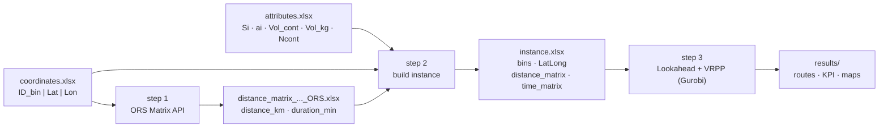

# VRPP + Lookahead — selective waste collection

Project for planning bin collection routes (paper/cardboard, plastic, …) by
combining:

1. **Real road distance matrix** (OpenRouteService / OpenStreetMap).
2. **Lookahead**: classification of bins into `MustGo` / `MustGoLA` / `Optional`
   based on their current level and their daily fill rate.
3. **VRPP** (*Vehicle Routing Problem with Profits*) solved with **Gurobi**: it
   chooses *which* bins to collect and in *what* order, maximising net profit.

Reference instance included: **491 bins of cluster C7**
(Runa – Sobral de Monte Agraço – Arruda dos Vinhos), paper/cardboard fraction.

---

## 1. Architecture

```
vrpp-lookahead/
├── config/
│   └── instance_491_C7.yaml         ← THE ONLY parameterisation point
├── data/
│   ├── raw/                         ← user inputs
│   │   ├── coordinates_491_C7_Runa_Sobral_Arruda.xlsx   (ID_bin | Latitude | Longitude)
│   │   └── attributes_491_C7_paper.xlsx                 (id_contentor | Si | ai | Vol_cont | Vol_kg | Ncont)
│   ├── matrices/                    ← step 1 output (ORS matrix)
│   └── instances/                   ← step 2 output (4-sheet workbook)
├── scripts/
│   ├── 01_build_ors_matrix.py
│   ├── 02_build_instance.py
│   └── 03_run_vrpp.py
├── src/vrpp_lookahead/
│   ├── config.py        parameters (dataclasses + YAML + CLI overrides)
│   ├── ors_matrix.py    step 1 — OpenRouteService Matrix API
│   ├── instance.py      step 2 — building, loading, validation and diagnostics
│   ├── lookahead.py     step 3a — MustGo / MustGoLA classification
│   ├── vrpp.py          step 3b — MILP model in Gurobi
│   ├── reporting.py     step 3c — Folium maps + 10-sheet Excel workbook
│   └── simulation.py    step 3 — day loop
├── notebooks/VRPP_Lookahead.ipynb   ← thin shell over the package
└── results/<label>/                 ← routes, KPI and maps (not versioned)
```

Design rules that keep the project **stable and reusable**:

| Rule | Where |
|---|---|
| A single parameterisation point; no magic numbers in the code | `config/*.yaml` |
| No global state: everything travels in `Config` / `Instance` / `Solution` | `src/` |
| Early validation with clear messages (duplicate IDs, NaN, matrix order) | `instance.py` |
| Zero *hard-coded* reference values (every total is computed from the file) | `instance.py`, `reporting.py` |
| Identical sheet names and KPI keys across instances → comparable results | `reporting.py` |
| API keys outside the code (`.env`, ignored by Git) | `config.ORS.api_key()` |

> The **algorithm has not changed**: `ors_matrix.py` is a direct port of
> `calcular_matriz_ORS.py`, and `vrpp.py` + `lookahead.py` reproduce exactly the
> model of the `VRPP_Lookahead_*` notebooks. Only the structure changed.

> **Column names in Portuguese.** `id_contentor | Si | ai | Vol_cont | Vol_kg | Ncont`
> come from the raw Excel files supplied by the user, so they are kept as they are.
> Everything else — code, sheet names, KPI keys, CLI flags — is in English.

---

## 2. Pipeline



### Step 1 — distance matrix (OpenRouteService)

Queries the *Matrix API* in blocks of sources; the block size is computed
automatically as `floor(max_routes_per_request / n)` so the server limit is never
exceeded. Produces a workbook with 6 sheets: `ordered_nodes`, `distance_km`
(km), `duration_min` (min), `distance_model`, `duration_model`, `long_format`.

```bash
python scripts/01_build_ors_matrix.py --config config/instance_491_C7.yaml
```

> **Only needed once per set of coordinates.** For instance 491_C7 the matrix is
> already in `data/matrices/`, so you can jump straight to step 2.

### Step 2 — build the instance

Combines attributes + coordinates + ORS matrix into the 4-sheet workbook consumed
by the VRPP. The node order is the one of the ORS matrix (depot `id = 0` first),
which guarantees `distance_matrix.index[1:] == bins.id_contentor`.

```bash
python scripts/02_build_instance.py --config config/instance_491_C7.yaml
```

### Step 3 — Lookahead + VRPP

```bash
python scripts/03_run_vrpp.py --config config/instance_491_C7.yaml
python scripts/03_run_vrpp.py --diagnose-only              # classify without optimising
python scripts/03_run_vrpp.py --Q 5000 --MAX_ROUTES 3      # override parameters
```

---

## 3. Editable parameters

They are edited in the YAML or, occasionally, on the command line. The ones in
the `model` section are the most frequently touched:

| Parameter | Meaning | Unit | Default | CLI flag |
|---|---|---|---|---|
| `B` | waste density | kg/m³ | 16 | `--B` |
| `Q` | vehicle capacity | kg | 3500 | `--Q` |
| `R` | revenue per kg collected | €/kg | 0.1625 | `--R` |
| `C` | travel cost | €/km | 1.0 | `--C` |
| `OMEGA` | fixed cost per vehicle | € | 0.1 | `--OMEGA` |
| `MAX_ROUTES` | max number of routes (`k ≤ MAX_ROUTES`) | — | 2 | `--MAX_ROUTES` |
| `MIP_GAP` | solver tolerance | — | 0.05 (5 %) | `--MIP_GAP` |
| `TIME_LIMIT` | solver time limit | s | 21600 (6 h) | `--TIME_LIMIT` |

Other blocks:

| Block | Parameter | Meaning |
|---|---|---|
| `lookahead` | `days` | simulated days |
| | `window` | lookahead horizon (days) |
| | `threshold_mg` | % for classifying as `MustGo` |
| | `threshold_overflow` | % for classifying as `MustGoLA` |
| `solver` | `knn` | nearest neighbours per node (arc filtering) |
| | `seed` | Gurobi seed (`null` = default) |
| | `keep_mustgo_arcs` | `true` = never filter out MustGo–MustGo arcs |
| | `generate_maps` | generate the Folium maps |
| `ors` | `transport_mode` | `driving-hgv`, `driving-car`, `cycling-regular`, … |
| | `max_routes_per_request` | ORS server limit of routes per request |
| | `pause_s` | pause between requests (free plan: ≤ 40/min) |

`parameters_used.json` is written into the results folder of every run: each
result is traceable back to the exact parameters that produced it.

---

## 4. Model

**Derived quantities** (defined once, in `instance.py`):

```
CAP_CONT_i = B · Ncont_i · Vol_cont_i     capacity of the point    [kg]
Si_kg_i    = Vol_kg_i                     current level            [kg]
ai_kg_i    = ai_i/100 · CAP_CONT_i        daily accumulation       [kg/day]
```

**Classification (lookahead)**

```
MustGo    : level_i + ai_kg_i        ≥ threshold_mg/100       · CAP_CONT_i
MustGoLA  : level_i + ai_kg_i · k    ≥ threshold_overflow/100 · CAP_CONT_i,  k = 2..window
```

**VRPP**

```
max   R · Σ_i S_i·g_i  −  C · Σ_ij D_ij·x_ij  −  OMEGA · k
s.t.  k ≤ MAX_ROUTES
      g_i = 1                          for every MustGo / MustGoLA
      in-degree = out-degree = g_i
      Σ y_ij − Σ y_ji = S_i·g_i        (load collected; y_ij ≤ Q·x_ij, vehicles leave empty)
      unit flow f_ij                   (subtour elimination)
```

*Pre-processing:* arc filtering by bidirectional KNN + removal of pairs that
exceed `Q`; warm start (nearest neighbour over the MustGo points).

*Automatic MustGo adjustment:* if the weight of the MustGo exceeds
`MAX_ROUTES · Q`, the least full ones (as a % of `CAP_CONT`) are downgraded to
`Optional` — without this the model would be infeasible. The solver may still
collect them if they turn out to be profitable, and they are recorded with the
reason `MG_downgraded_fleet_full`.

---

## 5. Outputs

For every simulated day, in `results/<label>/Day_XX/`:

* `route_N.html` — Folium map with the stop sequence (red = MustGo,
  orange = MustGoLA, blue = Optional, house = depot).
* `result_Day_XX.xlsx` — 10 sheets:

| Sheet | Content |
|---|---|
| `1_Lookahead` | level, forecast and group of each bin |
| `2_KPI_General` | objective function, waste, bins, routes, solver |
| `3_KPI_Routes` | one row per route, with the full sequence |
| `4_RouteN_Seq` | detailed sequence of each route |
| `5_MustGo` / `6_MustGoLA` | critical points and whether they were collected |
| `7_Not_Visited` | not visited and the reason why |
| `8_All_Bins` | status of all 491 points |
| `9_Parameters` | parameters of the run |
| `10_Verification` | capacity, arc and gap checks |

And at the root of the instance: `summary_<label>_all_days.xlsx` (KPI per day,
consolidated KPI and diagnostics) + `parameters_used.json`.

---

## 6. Installation

```bash
git clone <repo-url>
cd vrpp-lookahead

python -m venv .venv
.venv\Scripts\activate            # Windows;  source .venv/bin/activate on Linux/macOS
pip install -r requirements.txt

copy .env.example .env            # and put your ORS_API_KEY inside (only for step 1)
```

External requirements:

* **Gurobi** with a valid licence (the free *size-limited* licence is not enough
  for 491 bins; an academic or commercial one is).
* **OpenRouteService key** — free sign-up at
  <https://openrouteservice.org/dev/#/signup>. Only needed for step 1.

---

## 7. Adding a new instance

1. Put in `data/raw/` the coordinates file (`ID_bin | Latitude | Longitude`,
   with the depot as `ID_bin = 0`) and the attributes file
   (`id_contentor | Si | ai | Vol_cont | Vol_kg | Ncont`).
2. Copy `config/instance_491_C7.yaml` → `config/instance_XXX.yaml` and change
   `label` and `paths`.
3. Run steps 1 → 2 → 3 with `--config config/instance_XXX.yaml`.

No code changes are needed: the three steps are agnostic to the instance size.

---

## 8. Connecting to GitHub

```bash
git init                       # already done if the repo was created with this project
git add .
git commit -m "VRPP + Lookahead: initial structure"
git branch -M main
git remote add origin https://github.com/<user>/<repo>.git
git push -u origin main
```

`.gitignore` excludes `.env`, `results/` and the **generated** Excel files
(`data/matrices/*.xlsx`, `data/instances/*.xlsx`) because they are heavy and
reproducible with steps 1 and 2. To version a specific one:

```bash
git add -f data/matrices/distance_matrix_491_C7_Runa_Sobral_Arruda_ORS.xlsx
```

> **Security:** the ORS key that used to be written inside
> `calcular_matriz_ORS.py` is no longer in the code. Since it was in plain text,
> it is worth **regenerating** it in the OpenRouteService dashboard before
> publishing the repository.

---

## 9. Origin of the code

| This project | Original file |
|---|---|
| `src/vrpp_lookahead/ors_matrix.py` | `PhDtese/Matriz_Distances/calcular_matriz_ORS.py` |
| `src/vrpp_lookahead/{lookahead,vrpp,reporting,simulation}.py` | `cenario4 Papel/…/VRPP_Lookahead_536_riomaior_2rotas.ipynb` |
| `data/raw/coordinates_491_C7_*.xlsx` | `Contentores_491_C7_ Runa_Sobral_Arruda_papel.xlsx` |
| `data/matrices/distance_matrix_491_C7_*_ORS.xlsx` | `matriz_distancias_491_C7_Runa_Sobral_Arruda_ORS.xlsx` |
| `data/raw/attributes_491_C7_paper.xlsx` | sheet `contentores` of `Contentores491_C7_papel.xlsx` |
