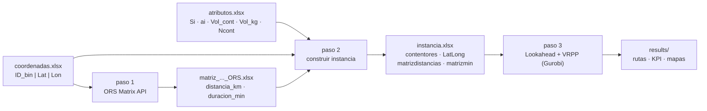

# VRPP + Lookahead — recolección selectiva de residuos

Proyecto para planificar rutas de recogida de contenedores (papel/cartón, plástico, …)
combinando:

1. **Matriz de distancias real** por carretera (OpenRouteService / OpenStreetMap).
2. **Lookahead**: clasificación de contenedores en `MustGo` / `MustGoLA` / `Opcional`
   según su nivel actual y su tasa de llenado diaria.
3. **VRPP** (*Vehicle Routing Problem with Profits*) resuelto con **Gurobi**: se elige
   *qué* contenedores recoger y en *qué* orden, maximizando el beneficio neto.

Instancia de referencia incluida: **491 contenedores del clúster C7**
(Runa – Sobral de Monte Agraço – Arruda dos Vinhos), fracción papel/cartón.

---

## 1. Arquitectura

```
vrpp-lookahead/
├── config/
│   └── instancia_491_C7.yaml        ← ÚNICO punto de parametrización
├── data/
│   ├── raw/                         ← entradas del usuario
│   │   ├── coordenadas_491_C7_Runa_Sobral_Arruda.xlsx   (ID_bin | Latitude | Longitude)
│   │   └── atributos_491_C7_papel.xlsx                  (id_contentor | Si | ai | Vol_cont | Vol_kg | Ncont)
│   ├── matrices/                    ← salida del paso 1 (matriz ORS)
│   └── instancias/                  ← salida del paso 2 (libro de 4 hojas)
├── scripts/
│   ├── 01_gerar_matriz_ors.py
│   ├── 02_construir_instancia.py
│   └── 03_correr_vrpp.py
├── src/vrpp_lookahead/
│   ├── config.py        parámetros (dataclasses + YAML + overrides CLI)
│   ├── ors_matrix.py    paso 1 — Matrix API de OpenRouteService
│   ├── instancia.py     paso 2 — construcción, carga, validación y diagnóstico
│   ├── lookahead.py     paso 3a — clasificación MustGo / MustGoLA
│   ├── vrpp.py          paso 3b — modelo MILP en Gurobi
│   ├── reporting.py     paso 3c — mapas Folium + libro Excel de 10 hojas
│   └── simulacao.py     paso 3 — ciclo de días
├── notebooks/VRPP_Lookahead.ipynb   ← cáscara fina sobre el paquete
└── results/<etiqueta>/              ← rutas, KPI y mapas (no versionado)
```

Reglas de diseño que hacen el proyecto **estable y reutilizable**:

| Regla | Dónde |
|---|---|
| Un solo punto de parametrización; ningún número mágico en el código | `config/*.yaml` |
| Sin estado global: todo viaja en `Config` / `Instancia` / `Solucao` | `src/` |
| Validación temprana con mensajes claros (IDs duplicados, NaN, orden de matrices) | `instancia.py` |
| Cero valores de referencia *hard-coded* (todos los totales se calculan del fichero) | `instancia.py`, `reporting.py` |
| Nombres de hojas y claves KPI idénticos entre instancias → resultados comparables | `reporting.py` |
| Claves API fuera del código (`.env`, ignorado por Git) | `config.ORS.api_key()` |

> El **algoritmo no ha cambiado**: `ors_matrix.py` es un porte directo de
> `calcular_matriz_ORS.py`, y `vrpp.py` + `lookahead.py` reproducen exactamente el
> modelo de los notebooks `VRPP_Lookahead_*`. Lo único que cambió es la estructura.

---

## 2. Pipeline



### Paso 1 — matriz de distancias (OpenRouteService)

Consulta la *Matrix API* por bloques de orígenes; el tamaño del bloque se calcula
automáticamente como `floor(max_routes_per_request / n)` para no superar nunca el
límite del servidor. Produce un libro con 6 hojas: `nodos_ordenados`, `distancia_km`
(km), `duracion_min` (min), `distancia_modelo`, `duracion_modelo`, `formato_largo`.

```bash
python scripts/01_gerar_matriz_ors.py --config config/instancia_491_C7.yaml
```

> **Solo hace falta una vez por conjunto de coordenadas.** Para la instancia 491_C7
> la matriz ya está en `data/matrices/`, así que puedes saltar directamente al paso 2.

### Paso 2 — construir la instancia

Combina atributos + coordenadas + matriz ORS en el libro de 4 hojas que consume el
VRPP. El orden de los nodos es el de la matriz ORS (depósito `id = 0` primero), lo que
garantiza `matrizdistancias.index[1:] == contentores.id_contentor`.

```bash
python scripts/02_construir_instancia.py --config config/instancia_491_C7.yaml
```

### Paso 3 — Lookahead + VRPP

```bash
python scripts/03_correr_vrpp.py --config config/instancia_491_C7.yaml
python scripts/03_correr_vrpp.py --so-diagnostico          # clasifica sin optimizar
python scripts/03_correr_vrpp.py --Q 5000 --MAX_ROTAS 3    # sobrescribe parámetros
```

---

## 3. Parámetros editables

Se editan en el YAML o, puntualmente, por línea de comandos. Los de la sección
`modelo` son los que se tocan con más frecuencia:

| Parámetro | Significado | Unidad | Por defecto | Flag CLI |
|---|---|---|---|---|
| `B` | densidad de los residuos | kg/m³ | 16 | `--B` |
| `Q` | capacidad del vehículo | kg | 3500 | `--Q` |
| `R` | ingreso por kg recogido | €/kg | 0.1625 | `--R` |
| `C` | coste de desplazamiento | €/km | 1.0 | `--C` |
| `OMEGA` | coste fijo por vehículo | € | 0.1 | `--OMEGA` |
| `MAX_ROTAS` | nº máximo de rutas (`k ≤ MAX_ROTAS`) | — | 2 | `--MAX_ROTAS` |
| `MIP_GAP` | tolerancia del solver | — | 0.05 (5 %) | `--MIP_GAP` |
| `TIME_LIMIT` | tiempo máximo del solver | s | 21600 (6 h) | `--TIME_LIMIT` |

Otros bloques:

| Bloque | Parámetro | Significado |
|---|---|---|
| `lookahead` | `dias` | días simulados |
| | `janela` | horizonte de anticipación (días) |
| | `threshold_mg` | % para clasificar como `MustGo` |
| | `threshold_overflow` | % para clasificar como `MustGoLA` |
| `solver` | `knn` | vecinos más cercanos por nodo (filtrado de arcos) |
| | `seed` | semilla de Gurobi (`null` = por defecto) |
| | `preservar_arcos_mustgo` | `true` = nunca filtrar arcos MustGo–MustGo |
| | `gerar_mapas` | generar los mapas Folium |
| `ors` | `modo_transporte` | `driving-hgv`, `driving-car`, `cycling-regular`, … |
| | `max_routes_per_request` | límite de rutas por petición del servidor ORS |
| | `pausa_s` | pausa entre peticiones (plan gratuito: ≤ 40/min) |

`parametros_usados.json` se escribe en la carpeta de resultados de cada corrida:
cada resultado queda trazable a los parámetros exactos que lo generaron.

---

## 4. Modelo

**Magnitudes derivadas** (definidas una sola vez, en `instancia.py`):

```
CAP_CONT_i = B · Ncont_i · Vol_cont_i     capacidad del punto      [kg]
Si_kg_i    = Vol_kg_i                     nivel actual             [kg]
ai_kg_i    = ai_i/100 · CAP_CONT_i        acumulación diaria       [kg/día]
```

**Clasificación (lookahead)**

```
MustGo    : nivel_i + ai_kg_i        ≥ threshold_mg/100       · CAP_CONT_i
MustGoLA  : nivel_i + ai_kg_i · k    ≥ threshold_overflow/100 · CAP_CONT_i,  k = 2..janela
```

**VRPP**

```
max   R · Σ_i S_i·g_i  −  C · Σ_ij D_ij·x_ij  −  OMEGA · k
s.a.  k ≤ MAX_ROTAS
      g_i = 1                          para todo MustGo / MustGoLA
      grado de entrada = grado de salida = g_i
      Σ y_ij − Σ y_ji = S_i·g_i        (carga recogida; y_ij ≤ Q·x_ij, vehículos salen vacíos)
      flujo unitario f_ij              (eliminación de subrutas)
```

*Preprocesamiento:* filtrado de arcos por KNN bidireccional + eliminación de pares que
superan `Q`; arranque en caliente (vecino más cercano sobre los MustGo).

*Ajuste automático de MustGo:* si el peso de los MustGo supera `MAX_ROTAS · Q`, los
menos llenos (en % de `CAP_CONT`) se degradan a `Opcional` — sin esto el modelo sería
inviable. El solver todavía puede recogerlos si resultan rentables, y quedan
registrados con el motivo `MG_rebaixado_frota_cheia`.

---

## 5. Salidas

Por cada día simulado, en `results/<etiqueta>/Dia_XX/`:

* `rota_N.html` — mapa Folium con la secuencia de paradas (rojo = MustGo,
  naranja = MustGoLA, azul = Opcional, casa = depósito).
* `resultado_Dia_XX.xlsx` — 10 hojas:

| Hoja | Contenido |
|---|---|
| `1_Lookahead` | nivel, previsión y grupo de cada contenedor |
| `2_KPI_Geral` | función objetivo, residuos, contenedores, rutas, solver |
| `3_KPI_Rotas` | una fila por ruta, con la secuencia completa |
| `4_RotaN_Seq` | secuencia detallada de cada ruta |
| `5_MustGo` / `6_MustGoLA` | puntos críticos y si fueron recogidos |
| `7_Nao_Visitados` | no visitados y el motivo |
| `8_Todos_Contentores` | estado de los 491 puntos |
| `9_Parametros` | parámetros de la corrida |
| `10_Verificacao` | comprobaciones de capacidad, arcos, gap |

Y en la raíz de la instancia: `resumo_<etiqueta>_todos_dias.xlsx` (KPI por día,
KPI consolidados y diagnóstico) + `parametros_usados.json`.

---

## 6. Instalación

```bash
git clone <url-del-repo>
cd vrpp-lookahead

python -m venv .venv
.venv\Scripts\activate            # Windows;  source .venv/bin/activate en Linux/macOS
pip install -r requirements.txt

copy .env.example .env            # y pon dentro tu ORS_API_KEY (solo para el paso 1)
```

Requisitos externos:

* **Gurobi** con licencia válida (la licencia gratuita *size-limited* no basta para
  491 contenedores; académica o comercial sí).
* **Clave de OpenRouteService** — registro gratuito en
  <https://openrouteservice.org/dev/#/signup>. Solo se necesita para el paso 1.

---

## 7. Añadir una instancia nueva

1. Pon en `data/raw/` el fichero de coordenadas (`ID_bin | Latitude | Longitude`,
   con el depósito como `ID_bin = 0`) y el de atributos
   (`id_contentor | Si | ai | Vol_cont | Vol_kg | Ncont`).
2. Copia `config/instancia_491_C7.yaml` → `config/instancia_XXX.yaml` y cambia
   `etiqueta` y `rutas`.
3. Ejecuta los pasos 1 → 2 → 3 con `--config config/instancia_XXX.yaml`.

No hay que tocar el código: los tres pasos son agnósticos del tamaño de la instancia.

---

## 8. Conectar con GitHub

```bash
git init                       # ya hecho si el repo se creó con este proyecto
git add .
git commit -m "VRPP + Lookahead: estructura inicial"
git branch -M main
git remote add origin https://github.com/<usuario>/<repo>.git
git push -u origin main
```

`.gitignore` excluye `.env`, `results/` y los Excel **generados**
(`data/matrices/*.xlsx`, `data/instancias/*.xlsx`) porque son pesados y reproducibles
con los pasos 1 y 2. Si quieres versionar uno concreto:

```bash
git add -f data/matrices/matriz_distancias_491_C7_Runa_Sobral_Arruda_ORS.xlsx
```

> **Seguridad:** la clave ORS que estaba escrita dentro de `calcular_matriz_ORS.py`
> ya no aparece en el código. Como estuvo en texto plano, conviene **regenerarla**
> en el panel de OpenRouteService antes de publicar el repositorio.

---

## 9. Origen del código

| Este proyecto | Fichero original |
|---|---|
| `src/vrpp_lookahead/ors_matrix.py` | `PhDtese/Matriz_Distances/calcular_matriz_ORS.py` |
| `src/vrpp_lookahead/{lookahead,vrpp,reporting,simulacao}.py` | `cenario4 Papel/…/VRPP_Lookahead_536_riomaior_2rotas.ipynb` |
| `data/raw/coordenadas_491_C7_*.xlsx` | `Contentores_491_C7_ Runa_Sobral_Arruda_papel.xlsx` |
| `data/matrices/matriz_distancias_491_C7_*_ORS.xlsx` | `matriz_distancias_491_C7_Runa_Sobral_Arruda_ORS.xlsx` |
| `data/raw/atributos_491_C7_papel.xlsx` | hoja `contentores` de `Contentores491_C7_papel.xlsx` |
